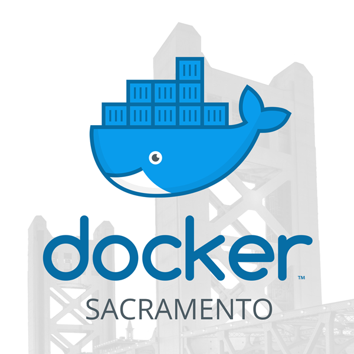

# Introduction

This is a use case demo showcasing some of the features in swarm.  We'll use this for a presentation that we are providing for one of our first Docker Meetup groups in Sacramento.

## Requirements

1. You'll need [Oracle Virtual Box 5.1+](https://www.oracle.com/virtualization/virtualbox/index.html).
1. A copy of the [`docker-machine`](https://github.com/docker/machine/releases/tag/v0.12.1) executable for your OS.
1. A system with about ~16G of RAM, and 4 Cores.  SSD drive is highly desirable.  An internet connection with 10 mBits / sec or better.

## Time Estimate

- Allow 60 minutes for swarm cluster provisioning.
- Allow 30 minutes to execute the demo.

## How to prepare

## What have we done so far and whats next?

## Running the demo

Now lets do [swarm use cases](demo/README.md)!

## Trouble shoot

FAQ
