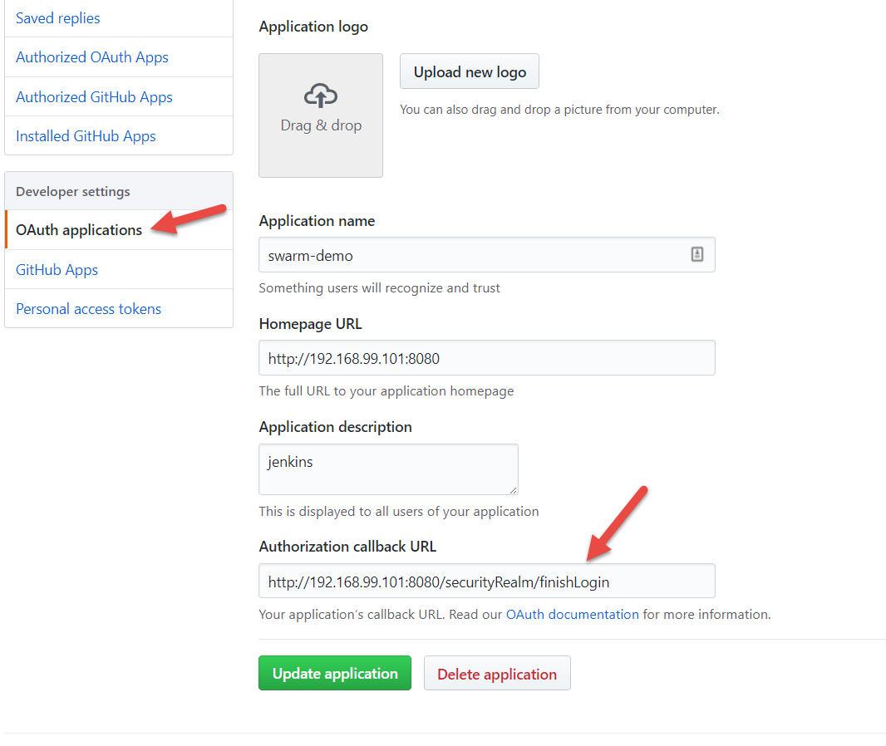

# Introduction

This use case will implement the jenkins official image
and setup jenkins on the first node of the swarm cluster
with required plugins.  We'll use `yet-another-docker-plugin` to
integrate slave nodes into our swarm cluster.

## Setup
1. Getting secrets setup to auth with GitHub requires an application to setup in GitHub:  
   
1. Create a github token that will be used for global authentication to pull seed repo information if necessary
1. setup secrets with `make secrets`
1. build the container on the first swarm node with the command:
   `make build`
1. deploy the jenkins server with the command : `make deploy`
1. setup slave images on some of the nodes with : `make slaves`


## Test

You can validate that the jenkins server is running by checking
with swarm that service is available.  Run the command:
```
make status
```

You can also navigate to the url:  
```
 http://$(docker-machine ip swarm-node-1):8080
```

## Exercise
1. Using the yadp plugin with jenkins to schedule jobs
1. Deploying an application with A/B pattern using jenkins
1. Perform backups with S3 API's of the consul backend store

## Un-deploy

You can undeploy the jenkins server with the command:
```
make clean
```
